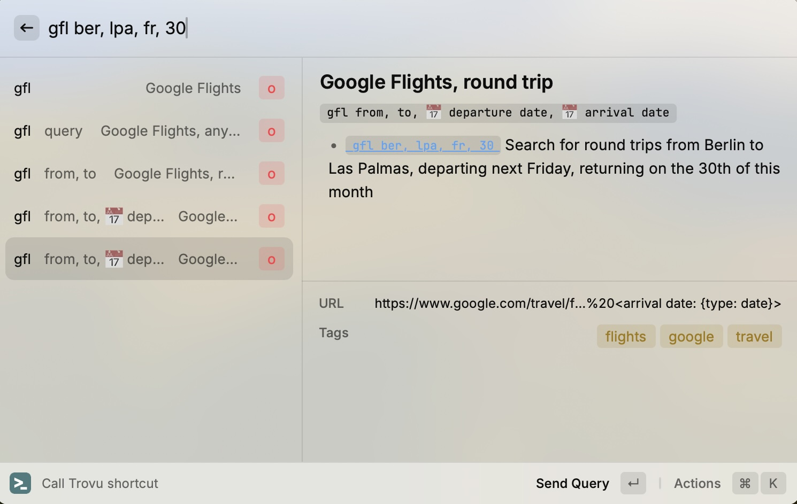
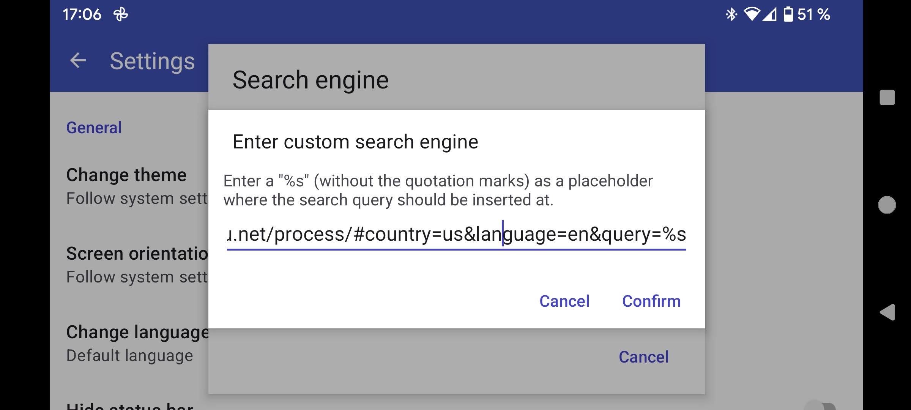

# Use Trovu on your device

## General

You can integrate Trovu into your web browsing experience using one of two methods:

### Set Trovu as Your Default Search Engine

-   By replacing your current default search engine with Trovu, all your searches will be directed to Trovu.
-   You can enhance this setup with a [Default Keyword](advanced.md#default-keyword), allowing any unrecognized Trovu shortcut to revert to your usual default search engine.

### Add Trovu as an Additional Search Engine

-   This method allows you to keep your current default search engine while adding Trovu alongside it.
-   To use Trovu shortcuts, simply prefix your query with a designated keyword (e.g., `t`).

I recommend the second option for beginners. Many users who chose the first option found that their intended searches were disrupted when the first word of their query triggered a Trovu shortcut.

With Option 2, you maintain greater control and predictability over your searches, allowing you to experiment with Trovu shortcuts only when you choose to.

## Desktop web browser

### Firefox

#### Browser extension

The easiest way to use Trovu in Firefox is the [browser add-on](https://addons.mozilla.org/firefox/addon/trovu/). It allows you to set keyboard shortcuts which open a Trovu input with suggestions in a new tab or window.

#### (Default) search engine

Another option is adding Trovu as a search engine, optionally making it default.

However, no shortcut suggestions are available here.

1.  Open [trovu.net](https://trovu.net/), either [with your GitHub username](advanced.md) or without:
    -   `https://trovu.net/?#github=YOUR_GITHUB_USERNAME`, or
    -   `https://trovu.net/?#country=gb&language=en`. (adjust to your country & language)
1.  In the **browser address bar**, right-click.
1.  Select **Add "Trovu"**. It is the last item.
1.  Open a [new tab](about:blank) with the URL:

        about:preferences#search

1.  Optional: Under **Default Search Engine**, select _Trovu_.

### Chrome

#### Browser extension

The easiest way to use Trovu in Chrome is the [browser extension](https://chromewebstore.google.com/detail/trovunet/iadcllehbnbepkalhgljhdfhjbkgkajo). It allows you to set keyboard shortcuts which open a Trovu input with suggestions in a new tab or window.

#### (Default) search engine

Another option is adding Trovu as a search engine, optionally making it default.

However, no shortcut suggestions are available here.

1.  Open [trovu.net](https://trovu.net/), either [with your GitHub username](advanced.md) or without:
    -   `https://trovu.net/?#github=YOUR_GITHUB_USERNAME`, or
    -   `https://trovu.net/?#country=gb&language=en`. (adjust to your country & language)
1.  Open a [new tab](about:blank) with the URL:

        chrome://settings/searchEngines

1.  There, right to **Manage search engines** is a search field. Search for _Trovu_.
1.  Now you can either
    -   Make Trovu your default search engine:
        1.  When found, click the 3 dots right to it.
        1.  Select **Make default**.
    -   Set a keyword for Trovu, and use it only with this keyword
        -   Click the 🖊️ pen.
        -   Edit _shortcut_, e.g. to `t`.

### Other

Use one of these URL templates and add it where your browser allows to set custom browser search engines:

    https://trovu.net/process/?#country=gb&language=en&query=%s
    https://trovu.net/process/?#github=YOUR_GITHUB_USERNAME&query=%s

(Note the `process/` part in the URL! You may need to adjust your `country`, `language` or `github` parameter.)

## Mac OS

### Raycast

[Raycast](<https://en.wikipedia.org/wiki/Raycast_(software)>) is an extendable launcher for Mac OS. The [Trovu extension](https://www.raycast.com/jorges/trovu) allows calling Trovu shortcuts from everywhere in Mac OS, incl. an interface showing shortcut suggestions:

## Android

### Simple Search

A free, generic app, allows also adding custom search engines.

1. Tap on the 3 dots in the upper right corner
1. Tap on _Settings_
1. Tap on _Search engine_
1. Pick one of the _Custom_ ones
1. In the input field, enter a URL template like in [Browser / other](#other)
1. Tap _Confirm_

### SearchBar Ex - Search Widget

This a free, generic app to search any search engine that supports URL with a `%s` placeholder.

1. With your Android device, [visit the app in the Play store](https://play.google.com/store/apps/details?id=com.devhomc.search)
1. Install it on your device.
1. Open the app.
1. Left to the search input, click on the icon.
1. At the botton, click **+ Add**
1. Select **Search**
1. Select **Custom Search**
1. For _name_, enter "Trovu"
1. For _URL_, enter a URL template like in [Browser / other](#other).
1. Click the back button of the app in the upper left corner

Now, you can enter Trovu queries which will be redirected to your browser.

### Firefox for Android

Firefox allows adding custom search engines: Any URL with a `%s` placeholder works.

1. Tap on the address bar
1. Tap on the search engine icon left to the address bar. Likely, it will be the Google icon
1. Tap on _⚙️ Search settings_
1. Tap on _Default search engine_
1. Tap on _➕ Add search engine_
1. Enter a name, e.g. `Trovu`
1. Enter the _URL to use for search_, like described under [Other](#other)
1. Tap on _Save_ (in the upper right corner)
1. Now you are back on the list of search engines. You may pick your newly added _Trovu_ as the default one.

Here is an example setting for the user `georgjaehnig`:

### Nova Launcher

If you use Nova Launcher, you can add add Trovu to Nova's search bar to search directly from the home screen.

How to set up:

1. Open the _Nova Setttings_ app.
1. Open the _Search_ section
1. Scroll down to _Search More providers_ and open that section
1. Tap the floating _+_ button
1. Enter the _URL to use for search_, as described under [Other](#other).
1. Enter a name, e.g. `Trovu`
1. Tap _OK_
1. Scroll all the way down to find your newly added search provider. Make sure the checkbox next to it is ticked. You may also use the handle on the right to move it all the way to the top of the list, so search with Trovu will get prioritized.
1. Tap the home button (or perform the corresponding gesture) to leave the settings app.

How to use:

1. From the home screen, tap on the Nova search bar.
1. Type a query. You should see a little Trovu icon appear underneath it, along with other search provider icons.
1. Start the search by tapping the Trovu icon. If the Trovu icon is in first position among the search provider icons (on the left), you may also just tap _Enter_. Your default browser should open with the search results.

## PWA (Progressive web app)

On many operating systems, you can also install a [Progressive web app](https://en.wikipedia.org/wiki/Progressive_web_app) of Trovu.

1. Open [trovu.net](https://trovu.net/) in the browser.
1. Open the browser menu.
1. Tap on _Install app_.
1. In the dialog, tap on _Install_.
1. In the next dialog, tap on _Add to homescreen_.
1. Go to your home screen.
1. You will find a new icon _Trovu_. Tap on it. The Trovu PWA will open.
1. To change the language or country, tap on the language/country in the upper right corner. By tapping on _Advanced_, you can also [set your GitHub account](advanced.md).

Now, you will find the Trovu icon on your phone home screen. Tap on it to open the Trovu PWA.
